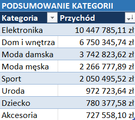
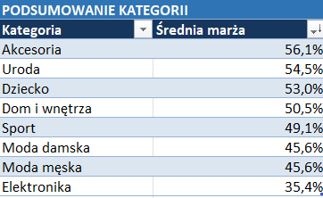
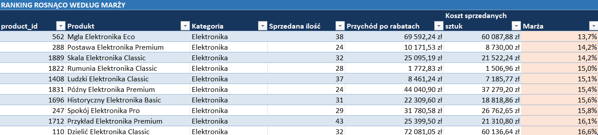
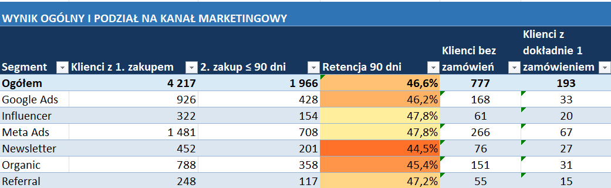
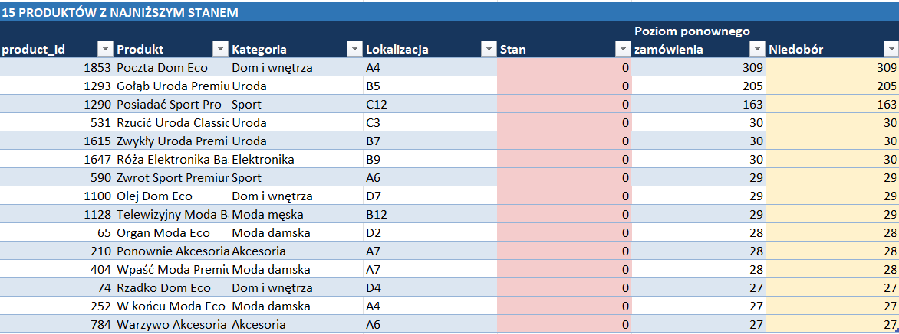
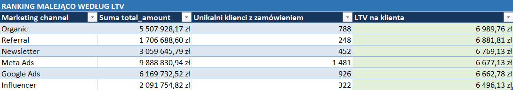
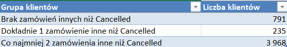
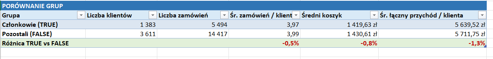
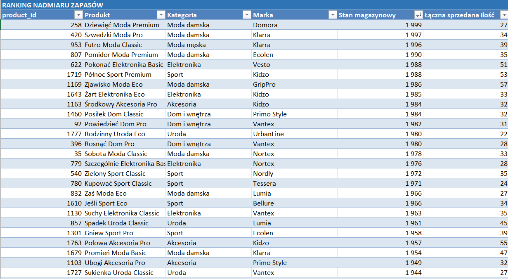

# ShopFlow – E-commerce Data Analysis

## 🎯 Cel projektu

Celem projektu była analiza danych sprzedażowych sklepu internetowego **ShopFlow** oraz przygotowanie danych do wiarygodnej analizy biznesowej.

Projekt obejmował:
- identyfikację i naprawę problemów jakości danych,
- analizę sprzedaży,
- analizę klientów i produktów,
- analizę sezonowości,
- analizę stanów magazynowych.


## 🗂️ Dane

Dane pochodzą z symulowanego sklepu internetowego ShopFlow i zawierają 5 tabel.  
Zakres czasowy analizy wynosi 24 miesiące

| Tabela | Liczba rekordów | Zawartość |
|---|---:|---|
| `customers` | ~5 000 | Dane klientów: lokalizacja, kanał pozyskania, data rejestracji, udział w programie lojalnościowym |
| `products` | ~2 000 | Katalog produktowy: kategoria, marka, cena, koszt, data wprowadzenia do oferty |
| `orders` | ~20 000 | Nagłówki zamówień: klient, data, status, metoda płatności, wartość, kanał marketingowy |
| `order_items` | ~49 000 | Pozycje zamówień: produkt, ilość, cena w momencie zakupu, rabat |
| `inventory` | 2 000 | Stany magazynowe: ilość na stanie, próg uzupełnienia, lokalizacja w magazynie |

### Główne obszary danych:
- klienci,
- produkty,
- zamówienia,
- pozycje zamówień,
- stany magazynowe.

---

## 🔧 Narzędzia i technologie
- **Microsoft Excel** – analiza i prezentacja wyników
- **Copilot** – wsparcie przy tworzeniu i optymalizacji zapytań

---

## Kontekst biznesowy
Kontekst biznesowy
ShopFlow Sp. z o.o.- sklep internetowy działający na polskim rynku e-commerce od 2021 roku.
- ~40 tys.
zarejestrowanych klientów
- 2 000
produktów w katalogu
- 20 000
zamówień (12 mies., próbka)
- 187 zł
średnia wartość koszyka (AOV)

| Parametr | Wartość |
|-----------|----------|
| Branża | E-commerce – moda, dom i wnętrza, elektronika użytkowa, uroda |
| Rynek | Polska (dostawy krajowe, brak jeszcze ekspansji zagranicznej) |
| Model biznesowy | B2C, sprzedaż wyłącznie online (własny sklep + integracja z Allegro) |
| Liczba klientów w bazie | ok. 5 000 aktywnych kont (dane do warsztatu – w rzeczywistości ShopFlow ma ok. 38 000 zarejestrowanych klientów, warsztat pracuje na próbce) |
| Liczba zamówień | ok. 20 000 (12 miesięcy wstecz, próbka reprezentatywna) |
| Liczba produktów w katalogu | ok. 2 000 SKU w 8 kategoriach |
| Średnia wartość koszyka (AOV) | 187 zł |
| Zespół | 34 osoby: e-commerce, marketing, logistyka, obsługa klienta, 1-osobowy zespół analityczny (do niedawna 0-osobowy) |
| Siedziba i magazyn | Poznań |

## 🚨 Główne wyzwania biznesowe

ShopFlow zmaga się z kilkoma kluczowymi problemami biznesowymi, które ograniczają dalszy wzrost firmy:

1. Rosnący koszt pozyskania klienta. Koszt pozyskania klienta (CAC) wzrósł o **34% rok do roku**, a dział marketingu nie posiada jednoznacznej informacji, które kanały marketingowe generują najbardziej wartościowych klientów.
2. Niska retencja klientów.
Według założeń biznesowych jedynie około **22% klientów** składa drugie zamówienie w ciągu 6 miesięcy od pierwszego zakupu.
3. Problemy z zarządzaniem zapasami. Najpopularniejsze produkty są regularnie niedostępne w magazynie, co prowadzi do utraty części sprzedaży. Jednocześnie część asortymentu zalega przez wiele miesięcy, generując dodatkowe koszty magazynowania.
4. Brak przejrzystości rentowności
Firma nie przeprowadziła dotychczas kompleksowej analizy marżowości poszczególnych kategorii produktowych, co utrudnia podejmowanie decyzji cenowych i zakupowych.
5. Niespójność danych między działami
Marketing, sprzedaż i logistyka korzystają z różnych raportów i wskaźników, przez co podejmowane decyzje często opierają się na odmiennych interpretacjach danych.
6. CAC (Customer Acquisition Cost)** – średni koszt pozyskania jednego nowego klienta.
7. Retencja – odsetek klientów powracających na kolejny zakup.
   
## 📝 Proces analizy

### 1. Przygotowanie danych

Przed rozpoczęciem właściwej analizy przeprowadzono kompleksową kontrolę jakości danych we wszystkich tabelach. Proces obejmował identyfikację oraz obsługę problemów, które mogły wpływać na wiarygodność wyników analizy.

W ramach przygotowania danych:

* usunięto i scalono duplikaty przy zachowaniu powiązanej historii danych,
* obsłużono braki danych oraz wartości wymagające dodatkowej weryfikacji,
* ujednolicono formaty dat, numerów telefonów, adresów e-mail oraz danych tekstowych,
* poprawiono literówki i niespójne nazwy kategorii oraz lokalizacji,
* zidentyfikowano błędne i nietypowe wartości,
* wykryto wartości odstające z wykorzystaniem metody IQR,
* naprawiono wybrane problemy z integralnością danych pomiędzy tabelami,
* zachowano historyczne rekordy w przypadkach, w których ich usunięcie mogłoby prowadzić do utraty istotnych informacji.

Dzięki temu przygotowano spójny i uporządkowany zbiór danych, który mógł zostać wykorzystany w dalszej analizie. Proces oczyszczania danych został przeprowadzony za pomocą **PostgreSQL** i **SQL** i znajduje się w osobnym projekcie https://github.com/Arturstrag/ShopFlow-E-commerce-Data-Cleaning-Project


### 2. Analiza biznesowa 
ShopFlow to sklep internetowy działający w kilku kategoriach produktowych. Zarząd firmy chciał lepiej zrozumieć, co naprawdę wpływa na wyniki biznesowe: które kategorie generują przychód, gdzie powstaje marża, dlaczego klienci wracają lub nie wracają oraz czy zapasy są zarządzane w odpowiedni sposób.

Celem analizy nie było wyłącznie przygotowanie zestawień i wykresów. Najważniejsze było znalezienie odpowiedzi na pytanie, które problemy rzeczywiście wymagają interwencji biznesowej. Dlatego każdą analizę rozpoczęto od konkretnego pytania, następnie zdefiniowano sposób obliczeń, zweryfikowano wynik i oddzielono obserwację od rekomendacji.

Analizę przeprowadzono na podstawie danych z tabel customers, products, orders, order_items oraz inventory. W zależności od pytania dane łączono po odpowiednich kluczach, takich jak customer_id i product_id. W obliczeniach uwzględniano również jakość danych i znaczenie poszczególnych statusów zamówień. Na przykład zamówienia anulowane nie były traktowane jako zrealizowane zakupy.

1. **Które kategorie generują największy przychód?** 

Pierwszym krokiem było ustalenie, które kategorie produktów są najważniejszym źródłem przychodu. Odpowiedź na to pytanie miała pomóc w ocenie, gdzie sklep powinien kierować działania marketingowe i sprzedażowe.

Na podstawie danych z tabel order_items oraz products obliczono przychód dla każdej pozycji zamówienia. W kalkulacji uwzględniono liczbę sprzedanych sztuk, cenę obowiązującą w chwili zamówienia oraz rabat udzielony klientowi.

Przychód dla pojedynczej pozycji obliczono według wzoru:
```
przychód = quantity × unit_price_at_order × (1 − discount_pct / 100)
```
Następnie pozycje zamówień połączono z katalogiem produktów za pomocą pola product_id. Dzięki temu każda pozycja otrzymała informację o swojej kategorii. Przychody zsumowano według kategorii produktów. Z zestawienia wykluczono kategorię **„Nieznana”**, ponieważ obejmowała pozycje, których nie można było wiarygodnie przypisać do właściwej kategorii.




Wyniki pokazały bardzo wyraźną koncentrację przychodu. Kategoria **Elektronika** wygenerowała **10 447 785,11 zł**, czyli około **38%** całego przychodu ujętego w zestawieniu. Łączny przychód ośmiu analizowanych kategorii wyniósł **27 738 887,20 zł**.

Na drugim końcu znalazły się **Akcesoria**, których przychód wyniósł **727 558,10 zł**. Różnica między Elektroniką a Akcesoriami jest znacząca, dlatego na pierwszy rzut oka naturalnym wnioskiem mogłoby być dalsze zwiększanie udziału Elektroniki w sprzedaży.

**Obserwacja**: Elektronika jest najważniejszym źródłem przychodu ShopFlow i odpowiada za większą część sprzedaży niż pozostałe kategorie. Jednocześnie sam przychód nie mówi jeszcze, czy sprzedaż tej kategorii jest najbardziej opłacalna.

**Rekomendacja biznesowa**: Elektronikę warto priorytetyzować w budżecie marketingowym i eksponować na stronie głównej sklepu. Decyzji nie należy jednak podejmować wyłącznie na podstawie przychodu. Wynik powinien być analizowany razem z marżą, rabatami i zwrotami, ponieważ wysoka sprzedaż może wiązać się z niższą rentownością.

2. **Które kategorie mają najwyższą marżę procentową, a które  najniższą?**

Wysoki przychód nie musi oznaczać wysokiego zysku. Dlatego kolejne pytanie dotyczyło marżowości poszczególnych kategorii.

Średnia marża procentowa pokazuje, jaka część ceny sprzedaży pozostaje po pokryciu kosztu zakupu lub wytworzenia produktu. Marżę dla pojedynczego produktu obliczono na podstawie danych z tabeli products.

```
marża procentowa = (unit_price − unit_cost) / unit_price × 100%
```
W obliczeniach pominięto produkty z ceną równą 0. Następnie obliczono średnią marżę dla każdej kategorii z pominięciem kategorii **"Nieznana"**. 



Elektronika osiągnęła średnią marżę na poziomie **35,4%**, podczas gdy najwyższą marżę odnotowano w kategorii Akcesoria — **56,1%**. Oznacza to, że Elektronika i Akcesoria reprezentują dwa różne modele biznesowe.

**Obserwacja**: Elektronika jest kategorią o najwyższym przychodzie, ale jednocześnie ma najniższą marżę spośród wszystkich kategorii. Jej marża jest o ponad 10 punktów procentowych niższa od średniej dla analizowanych kategorii. Akcesoria mają odwrotny profil: niski przychód i najwyższą marżę.
To oznacza, że sama decyzja o zwiększeniu sprzedaży Elektroniki mogłaby poprawić przychód, ale niekoniecznie poprawiłaby rentowność całego sklepu.

**Rekomendacja biznesowa**: Dla zarządu warto przygotować wspólną analizę przychodu i marży według kategorii. Elektronika i Akcesoria powinny być traktowane jako dwa uzupełniające się obszary. Elektronikę można wykorzystać do generowania ruchu i wysokiego wolumenu, natomiast Akcesoria mogą zwiększać marżę całego koszyka. Dobrym kierunkiem byłoby testowanie sprzedaży dodatkowej, na przykład proponowanie akcesoriów klientom kupującym elektronikę. Taka strategia mogłaby podnieść łączną marżę koszyka bez konieczności ograniczania sprzedaży głównej kategorii.

3. **Które produkty mają wysoką sprzedaż, ale niską marżę?**

Analiza kategorii pokazała, że Elektronika jest najbardziej problematyczna pod względem relacji przychodu do marży. Kolejnym krokiem było sprawdzenie, czy problem dotyczy całej kategorii, czy tylko wybranych produktów.

W tym celu przygotowano ranking 10 produktów o najniższej rzeczywistej marży spośród produktów sprzedanych w ilości większej niż 20 sztuk. Połączono dane z tabel order_items i products za pomocą pola product_id.

Dla każdego produktu zagregowano:

- liczbę sprzedanych sztuk;
- przychód po uwzględnieniu rabatów;
- koszt sprzedanych sztuk;
- zrealizowaną marżę procentową.

Przychód po rabatach obliczono według wzoru:

```
quantity × unit_price_at_order × (1 − discount_pct / 100)
```
Koszt sprzedanych sztuk obliczono jako:
```
quantity × unit_cost
```
Zrealizowaną marżę procentową obliczono na podstawie rzeczywistej ceny zapłaconej przez klienta:
```
(unit_price_at_order * (1 - discount_pct/100))
```
W analizie uwzględniono wyłącznie produkty sprzedane w ilości większej niż 20 sztuk oraz produkty z dodatnim przychodem. Dzięki temu ranking nie został zdominowany przez produkty sprzedane pojedynczo lub produkty z niepełnymi danymi.

    



Wyniki potwierdziły, że problem nie dotyczy wyłącznie średniej kategorii. Wszystkie 10 produktów o wysokiej sprzedaży i najniższej zrealizowanej marży należało do kategorii Elektronika.

Ich rzeczywista marża wynosiła od **13,7%** do **16,6%**, czyli znacznie mniej niż średnia katalogowa marża Elektroniki wynosząca **35,4%**. Różnica wynika przede wszystkim z rabatów, które obniżają cenę faktycznie płaconą przez klientów.

**Obserwacja**: Produkty o wysokiej sprzedaży i niskiej marży koncentrują się w Elektronice. Rabaty dodatkowo obniżają ich rzeczywistą marżę, przez co najbardziej popularne produkty niekoniecznie są najbardziej opłacalne.

**Rekomendacja biznesowa**: Pierwszym krokiem powinno być przeanalizowanie tych 10 konkretnych produktów, zamiast zmiany strategii dla całej kategorii. Warto rozpocząć renegocjację cen zakupu właśnie od tych SKU, ponieważ poprawa warunków dostaw mogłaby zwiększyć marżę bez ryzyka utraty całego wolumenu sprzedaży.
Równolegle należy sprawdzić, czy produkty te nie są zbyt często obejmowane promocjami. Jeśli mają niską marżę katalogową, rutynowe rabatowanie może dodatkowo pogarszać ich rentowność.

4. **Jacy klienci wracają najczęściej (drugi zakup)?**  

Po analizie przychodu i marży kolejnym obszarem była baza klientów. Zarząd zakładał, że głównym problemem ShopFlow jest niska retencja. Aby zweryfikować to założenie, przeanalizowano, ilu klientów dokonuje drugiego zakupu w ciągu 90 dni.

W analizie wykorzystano dane z tabel orders oraz customers. Zamówienia ze statusem Cancelled zostały pominięte, ponieważ anulowane zamówienie nie jest traktowane jako zrealizowany zakup.

Dla każdego klienta:
- uporządkowano zrealizowane zamówienia chronologicznie;
- ustalono datę pierwszego zakupu;
- ustalono datę drugiego zakupu;
- obliczono liczbę dni między pierwszym i drugim zakupem.

Liczbę dni między pierwszym i drugim zakupem obliczono:
```
dni do drugiego zakupu = data drugiego zakupu − data pierwszego zakupu
```
Klient otrzymywał wartość 1, jeśli drugi zakup nastąpił w ciągu maksymalnie 90 dni. W przeciwnym przypadku otrzymywał wartość 0.

Wskaźnik retencji 90-dniowej obliczono według wzoru:
```
liczba klientów z drugim zakupem ≤ 90 dni / liczba klientów z pierwszym zakupem × 100%
```
Następnie klientów połączono z tabelą customers, aby przeanalizować wyniki w podziale na kanał pozyskania.
   


Ogółem **44,0%** klientów, którzy zrealizowali co najmniej jeden zakup, dokonało drugiego zakupu w ciągu 90 dni. Wynik ten był dwukrotnie wyższy od celu zakładanego przez zarząd, który wynosił **22%**.

Różnice pomiędzy kanałami były umiarkowane. Najwyższą retencję odnotowano dla klientów pozyskanych przez Meta Ads i Influencer, a najniższą dla klientów z kanału Newsletter. Rozstęp pomiędzy kanałami wynosił około 4 punkty procentowe.

**Obserwacja**: Dane nie potwierdziły założenia, że głównym problemem ShopFlow jest brak powrotów klientów. Wśród osób, które dokonały pierwszego zakupu, retencja 90-dniowa wynosiła **44%**, czyli znacznie więcej niż zakładany cel.
Kanał pozyskania miał pewien wpływ na prawdopodobieństwo powrotu, ale różnice nie były na tyle duże, aby wskazać jeden kanał jako całkowicie skuteczny lub nieskuteczny. Znacznie ważniejszym problemem okazało się to, że część zarejestrowanych klientów w ogóle nie dokonała pierwszego zakupu.

**Rekomendacja biznesowa**: Cel biznesowy powinien zostać przeformułowany. Zamiast koncentrować się wyłącznie na zwiększaniu retencji z **22%** do **30%**, zarząd powinien mierzyć również aktywację, czyli odsetek zarejestrowanych klientów, którzy wykonali pierwszy zakup. Ponieważ Newsletter miał najniższą retencję i nie wyróżniał się wysokim LTV, warto dodatkowo sprawdzić, czy baza około **61 000** subskrybentów jest odpowiednio segmentowana. Warto porównać wyniki kampanii według typu klienta, historii interakcji oraz czasu od rejestracji.

5. **Jakie produkty są zagrożone brakiem w magazynie w najbliższym 
miesiącu?** 

Analiza klientów wskazała na problem aktywacji. Kolejnym pytaniem było sprawdzenie, czy firma jest przygotowana do obsługi popytu, szczególnie w przypadku produktów, które mogą wkrótce się wyczerpać.

W analizie wykorzystano tabele inventory oraz products, łącząc je po polu product_id.

Z tabeli products pobrano:

- nazwę produktu;
- kategorię;
- status is_active.

Z tabeli inventory wykorzystano:

- stock_quantity, czyli bieżący stan magazynowy;
- reorder_level, czyli poziom ponownego zamówienia;
- lokalizację magazynową.

Za produkty zagrożone brakiem uznano produkty spełniające jednocześnie dwa warunki:
```
is_active = TRUE
```
```
stock_quantity ≤ reorder_level
```
Dla każdego wybranego produktu obliczono 
```
niedobór = reorder_level − stock_quantity
```



Wyniki posortowano według najniższego stanu magazynowego. Na wykresie przedstawiono 15 produktów o najniższym stanie.

Analiza wykazała, że **434** aktywne produkty, czyli około **22%** całego katalogu, znajdowały się na poziomie progu zamówienia lub poniżej niego. Wśród nich było ponad **15** produktów z zerowym stanem magazynowym, między innymi „Organ Moda Eco”, „Dziadek Uroda Basic” oraz „Warzywo akcesoria”.

**Wynik**: Problem nie dotyczy pojedynczych produktów. Aż **22%** aktywnego katalogu wymagało uwagi pod kątem uzupełnienia zapasów.

**Obserwacja**: Skala zagrożenia jest większa, niż sugerowałaby ogólna informacja, że „części produktów czasami brakuje”. Wynik wskazuje na systemowy problem procesu uzupełniania zapasów. Sam próg reorder_level istnieje w danych, ale nie wynika z nich, że jest automatycznie wykorzystywany do uruchamiania działań.

**Rekomendacja biznesowa**: Należy wdrożyć automatyczne alerty reorderowe. System powinien informować zespół zakupowy o produktach, których stan spadł do poziomu ponownego zamówienia.Priorytetowo należy potraktować produkty z zerowym stanem oraz produkty o wysokiej historycznej sprzedaży. Dzięki temu proces uzupełniania zapasów będzie oparty na danych, a nie na ręcznym monitoringu i reagowaniu dopiero wtedy, gdy klient nie może już kupić produktu.

6. **Który kanał marketingowy generuje klientów o najwyższym LTV?** 

Kolejnym krokiem było sprawdzenie jakości klientów pozyskiwanych przez poszczególne kanały marketingowe. Sama liczba nowych klientów nie musi oznaczać, że kanał jest najbardziej wartościowy. Dlatego analizę rozszerzono o LTV, czyli Customer Lifetime Value.

LTV opisuje łączną wartość zakupów wygenerowaną przez przeciętnego klienta w całym analizowanym okresie.

Wykorzystano dane z tabel customers oraz orders. Każdemu zamówieniu przypisano kanał marketingowy klienta z tabeli customers. Następnie dla każdego kanału obliczono:
- sumę total_amount;
- liczbę unikalnych klientów, którzy złożyli co najmniej jedno zamówienie;
- średnią wartość zakupów przypadającą na jednego kupującego.

LTV obliczono według wzoru:
```
LTV = suma total_amount w kanale / liczba unikalnych kupujących w kanale
```
Klienci bez żadnego zamówienia nie zostali uwzględnieni w obliczeniach, ponieważ nie wygenerowali jeszcze przychodu.



Wyniki pokazały, że różnice pomiędzy kanałami były niewielkie. LTV na klienta mieściło się w przedziale od **6 496 zł** do **6 990 zł**, a rozstęp wynosił około **7%**.

Najwyższe LTV osiągnęli klienci z kanału Organic — **6 990 zł**, a najniższe klienci pozyskani przez Influencer — **6 496 zł**. Meta Ads generował największą liczbę klientów, ale jego LTV znajdowało się w środku zestawienia, a nie na pierwszym miejscu.

**Obserwacja**: Żaden kanał nie wyróżniał się zdecydowanie pod względem LTV. Meta Ads dostarczał dużego wolumenu klientów, ale nie generował klientów o najwyższej średniej wartości. Jest to szczególnie istotne, ponieważ kanał ten pochłaniał około **42%** wydatków marketingowych.

**Rekomendacja biznesowa**: Decyzji o podziale budżetu nie należy opierać wyłącznie na liczbie pozyskanych klientów ani na samym LTV. Należy zestawić LTV z kosztem pozyskania klienta, czyli CAC. Dopiero porównanie wartości klienta z kosztem jego pozyskania pozwoli ocenić, które kanały są rzeczywiście najbardziej efektywne. Dane dotyczące kosztów kampanii nie znajdowały się w obecnym zbiorze ShopFlow. Jest to ważna luka analityczna, którą należy świadomie uzupełnić w kolejnym etapie.

7.  **Ilu klientów robi zakupy tylko raz i nigdy nie wraca?** 

Analiza retencji pokazała, że klienci, którzy dokonali pierwszego zakupu, stosunkowo często wracają. Aby dokładniej zrozumieć sytuację, przeanalizowano całą bazę klientów i podzielono ją na trzy grupy:
- klientów bez żadnego zrealizowanego zamówienia;
- klientów z dokładnie jednym zrealizowanym zamówieniem;
- klientów z co najmniej dwoma zrealizowanymi zamówieniami.

Tabelę customers połączono z tabelą orders po polu customer_id. Zamówienia ze statusem ""Cancelled"" zostały pominięte, ponieważ nie stanowiły faktycznie zrealizowanych zakupów.

Dla każdego klienta policzono liczbę zrealizowanych zamówień, a następnie przypisano go do odpowiedniego segmentu.



Najważniejszy wynik dotyczył klientów, którzy jeszcze nie rozpoczęli zakupów. Aż **791** zarejestrowanych klientów, czyli **15,8%** całej bazy, nie miało żadnego zrealizowanego zamówienia. Jednocześnie spośród klientów, którzy dokonali pierwszego zakupu, aż **94,4%** wracało kiedykolwiek. Oznacza to, że popularne stwierdzenie „klienci nie wracają” nie opisuje właściwie problemu ShopFlow.

**Obserwacja**: Głównym problemem nie jest niska retencja klientów po pierwszym zakupie. Problemem jest to, że część zarejestrowanych klientów nigdy nie przechodzi od rejestracji do pierwszej transakcji. Dane zmieniły więc interpretację sytuacji biznesowej. Zarząd powinien rozdzielić dwa różne zjawiska:
- aktywację klienta, czyli doprowadzenie do pierwszego zakupu;
- retencję klienta, czyli zachęcenie go do kolejnych zakupów.

**Rekomendacja biznesowa**: Priorytetem dla zespołu CRM powinna być kampania aktywacyjna skierowana do **791** klientów bez żadnego zrealizowanego zakupu. Można przetestować ograniczony czasowo rabat powitalny, przypomnienie o niedokończonej ścieżce zakupowej lub kampanię dopasowaną do kanału pozyskania. Sukces kampanii powinien być mierzony liczbą klientów, którzy dokonali pierwszego zakupu, a nie samą liczbą wysłanych wiadomości.

8. **Czy członkowie programu lojalnościowego kupują częściej i 
więcej?**

ShopFlow Club działał już od ośmiu miesięcy. Naturalnym pytaniem było więc sprawdzenie, czy członkowie programu lojalnościowego kupują częściej i generują większą wartość niż pozostali klienci.

Klientów podzielono na dwie grupy:
loyalty_member = **TRUE** — członkowie programu,
loyalty_member = **FALSE** — pozostali klienci.
Dla każdej grupy obliczono:
- liczbę klientów;
- liczbę zamówień;
- średnią liczbę zamówień na klienta;
- średnią wartość koszyka;
- średni łączny przychód przypadający na klienta.




Wyniki nie pokazały wyraźnej przewagi członków programu. Członkowie ShopFlow Club mieli średnio **3,97** zamówienia na klienta, średni koszyk na poziomie **1 420 zł** oraz średni przychód na klienta wynoszący **5 640 zł**.

Dla klientów niebędących członkami programu wartości wynosiły odpowiednio **3,99** zamówienia, **1 431 zł** średniego koszyka oraz **5 712 zł** średniego przychodu na klienta.

**Obserwacja**: Na podstawie dostępnych danych członkowie programu lojalnościowego nie kupują częściej ani więcej niż pozostali klienci. Różnice są niewielkie, ale wszystkie trzy analizowane metryki są nawet nieznacznie niższe w grupie członków programu. Nie oznacza to jeszcze definitywnie, że program nie działa. Możliwe, że część klientów dołączyła do niego niedawno i nie miała wystarczająco dużo czasu, aby wygenerować mierzalny efekt.

**Rekomendacja biznesowa**: Przed dalszym inwestowaniem w rozwój ShopFlow Club należy przeprowadzić dodatkową analizę ograniczoną do klientów, którzy są członkami programu od co najmniej trzech miesięcy. Jeśli również w tej grupie nie pojawi się wyraźna różnica, warto zrewidować mechanikę programu. Należy sprawdzić, czy oferowane korzyści są dla klientów wystarczająco atrakcyjne i czy program rzeczywiście zachęca do częstszych zakupów, a nie tylko rejestruje kolejnych uczestników.

9.  **Które produkty mają najdłuższy czas "zalegania" na magazynie?** 
    
Analiza zapasów pokazała, że część produktów może być zagrożona brakiem. Równocześnie należało sprawdzić, czy druga część problemu nie polega na utrzymywaniu zbyt wysokich zapasów produktów, które sprzedają się wolno. W tym przypadku przeanalizowano dane z tabel inventory, products oraz order_items. Wybrano produkty, dla których stan magazynowy przekraczał 500 sztuk. Następnie zestawiono ich aktualny stan z łączną liczbą sprzedanych sztuk.



Analiza wykazała, że **830** produktów, czyli ponad **40%** katalogu, miało stan magazynowy powyżej **500** sztuk. Wśród produktów o największym stanie magazynowym znalazły się między innymi:
- „Dziewięć Moda Premium” — **1 999** sztuk w magazynie, tylko **27** sprzedanych sztuk;
- „Szwedzki Moda Pro” — **1 997** sztuk w magazynie, tylko **34** sprzedane sztuki.

**Wynik**: Znaczna część katalogu ma stan magazynowy nieproporcjonalny do rzeczywistej sprzedaży.

**Obserwacja**: ShopFlow ma jednocześnie dwa problemy: część produktów jest zagrożona brakiem, a część innych produktów zalega w magazynie w nadmiernych ilościach. Skala nadmiaru jest większa, niż sugerowałaby ogólna obserwacja, że „niektóre produkty zalegają miesiącami”. Problem dotyczy ponad 40% katalogu, dlatego nie można go traktować jako zbioru pojedynczych, nietrafionych decyzji zakupowych. Taka sytuacja może wskazywać na problem z prognozowaniem popytu, brak regularnej analizy rotacji lub niewystarczające powiązanie decyzji zakupowych z historyczną sprzedażą.

**Rekomendacja biznesowa**: Należy wprowadzić regularny raport rotacji zapasów oparty na relacji aktualnego stanu magazynowego do sprzedaży w określonym czasie. Produkty o najniższej rotacji powinny być automatycznie oznaczane do dalszej decyzji: wyprzedaży, ograniczenia kolejnych dostaw, przeniesienia do innego kanału sprzedaży albo wycofania z oferty. Jednocześnie raport powinien być analizowany razem z raportem produktów zagrożonych brakiem. Dopiero połączenie obu perspektyw pokaże pełny obraz zarządzania zapasami: gdzie sklep traci sprzedaż przez niedobór, a gdzie zamraża kapitał w produktach o zbyt niskiej rotacji.

## 💡Podsumowanie
Analiza danych sklepu internetowego ShopFlow pozwoliła zweryfikować kluczowe założenia biznesowe oraz wskazać obszary wymagające dalszej optymalizacji. Przed rozpoczęciem analizy przeprowadzono kompleksowe oczyszczenie i ujednolicenie danych, dzięki czemu wszystkie wnioski zostały oparte na spójnym i wiarygodnym zbiorze informacji.

Najważniejsze wnioski z analizy wskazują, że:

1. Problem ShopFlow nie dotyczy retencji, lecz aktywacji klientów.
 Analiza wykazała, że 94,4% klientów dokonujących pierwszego zakupu wraca po kolejne zamówienia, natomiast 15,8% zarejestrowanych użytkowników nigdy nie dokonuje zakupu. Sugeruje to, że działania biznesowe powinny koncentrować się na zwiększaniu aktywacji nowych klientów, a nie na poprawie retencji.

2. Elektronika jest strategiczną, ale wymagającą kategorią.
 Kategoria generuje najwyższy przychód, jednak jednocześnie osiąga najniższą marżę oraz najwyższy udział zwrotów. Wskazuje to na potrzebę odrębnej strategii obejmującej politykę cenową, promocje, dobór asortymentu oraz kontrolę jakości produktów.

3. Program lojalnościowy nie wykazuje obecnie mierzalnego wpływu na zachowania klientów.
 Po ośmiu miesiącach funkcjonowania uczestnicy programu nie osiągają lepszych wyników pod względem częstotliwości zakupów ani wartości klienta. Przed dalszymi inwestycjami warto przeprowadzić szczegółową ocenę skuteczności programu i zweryfikować jego założenia.

4. Zarządzanie zapasami wymaga optymalizacji procesu prognozowania popytu.
 Analiza wykazała, że 22% produktów jest zagrożonych brakiem w magazynie, podczas gdy 40% katalogu wykazuje nadmierne stany magazynowe. Współwystępowanie niedoborów i nadwyżek sugeruje problem systemowy związany z planowaniem zakupów i uzupełnianiem zapasów.

5. Ocena kanałów marketingowych powinna uwzględniać jakość pozyskiwanych klientów.
 Choć Meta Ads odpowiada za największy wolumen nowych klientów, generowany przez ten kanał poziom LTV nie jest najwyższy. Oznacza to, że decyzje budżetowe powinny opierać się nie tylko na liczbie pozyskanych klientów, lecz również na ich długoterminowej wartości dla firmy.

