# Analiza biznesowa
W tym pliku została przeprowadzona pełna analiza biznesowa sklepu ShopFlow. Podczas analizy odpowiedziano na następujące pytania biznesowe:

1. **Które kategorie generują największy przychód?** 

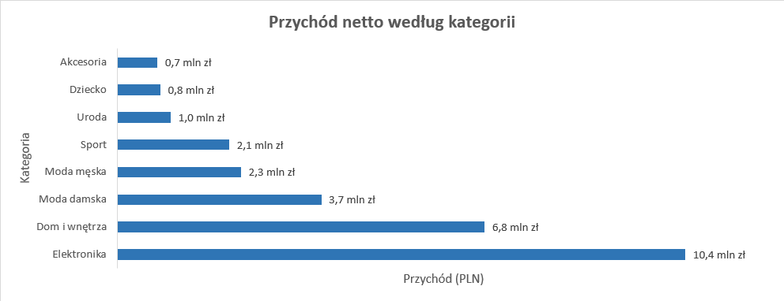

**Obserwacja:** Kategoria Elektronika generuje najwyższy przychód: **10 447 785,11 zł**, czyli **38%** przychodu ujętego w zestawieniu. Łączny przychód ośmiu kategorii wynosi **27 738 887,20 zł**. Najniższy wynik ma kategoria Akcesoria: **727 558,10 zł**.

**Rekomendacja:**  Należy priorytetyzować Elektronikę w budżecie marketingowym i 
eksponować ją na stronie głównej sklepu. Należy też monitorować to razem z marżą, a nie tylko z samym przychodem.

2. **Które kategorie mają najwyższą marżę procentową, a które  najniższą?**

**Obserwacja:** Elektronika - kategoria generująca najwyższy przychód - ma 
jednocześnie najniższą marżę ze wszystkich kategorii, o **10+** punktów 
procentowych poniżej średniej. Akcesoria mają odwrotny profil: niski **przychód**, ale 
najwyższą **marżę**. 

**Rekomendacja:** Należy zestawić tabele przychodu według kategorii i marży procentowej w jednej tabeli dla zarządu - Elektronika i Akcesoria to skrajne, ale uzupełniające się przypadki. 
Rozważyć podniesienie widoczności Akcesoriów jako produktów dodatkowych przy 
zakupie elektroniki (cross-sell), co podniosłoby łączną marżę koszyka bez utraty 
wolumenu głównej kategorii. 

3. **Jacy klienci wracają najczęściej (drugi zakup)?**  
   

**Ogółem:** **44,0%** klientów, którzy zrealizowali chociaż jeden zakup (nie licząc 
anulowanych), robi drugi zakup w ciągu 90 dni. 

**Obserwacja:** To wciąż dwukrotnie więcej niż zakładał zarząd **(22% retencji)**. Różnice 
między kanałami są umiarkowane **(44,5-47,8 punktu procentowego)**, rozstęp około **4 punktów procentowych**. Kanał pozyskania ma niewielki, ale zauważalny wpływ na szansę powrotu 
(**Meta Ads i Influencer najwyżej, Newsletter najniżej**). Prawdziwym problemem nie 
jest to, że klienci nie wracają - tylko to, że część w ogóle nie robi pierwszego zakupu. 

**Rekomendacja:** Zarząd powinien przeformułować cel z "podnieść retencję z **22% do 
30%"** na dokładniejszy: "podnieść aktywację (odsetek zarejestrowanych klientów, 
którzy w ogóle kupują)" - to jest metryka, która faktycznie ma miejsce do poprawy. 
Dodatkowo: skoro Newsletter ma najniższą retencję spośród kanałów, a 
jednocześnie nie wyróżnia się wysokim LTV, warto zapytać 
marketing, czy baza **61 000** subskrybentów jest odpowiednio segmentowana.

4. **Które produkty mają wysoką sprzedaż, ale niską marżę?**
    

**Obserwacja:** Wszystkie 10 produktów o wysokiej sprzedaży i niskiej marży to 
Elektronika - potwierdza to i pogłębia wniosek z **Pytania 2** na poziomie konkretnych 
SKU. Co ważniejsze: ich realna marża **(13,7–16,6%)** jest wyraźnie niższa niż średnia katalogowa marża Elektroniki **(35,4%, patrz Pytanie 2)** - te konkretne produkty są 
sprzedawane z rabatami, które dodatkowo zjadają i tak już najniższą marżę wśród wszystkich kategorii produktowych. 

**Rekomendacja:** Zacząć renegocjację cen zakupu od tych konkretnych, 
zidentyfikowanych 10 produktów - to najszybszy sposób na poprawę marży bez ryzyka utraty wolumenu w całej kategorii. Dodatkowo: sprawdzić politykę rabatową dla tych konkretnych SKU - być może są rutynowo obejmowane promocjami, które 
nie powinny na nie obowiązywać, skoro już wyjściowo mają niską marżę katalogową.

5. **Jak zmienia się sprzedaż miesiąc do miesiąca?** 

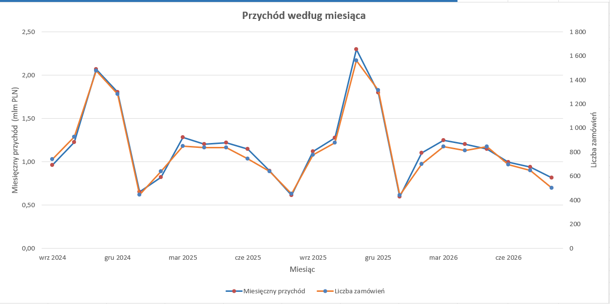

**Obserwacja:** Wyraźny, powtarzalny wzorzec sezonowy - listopad jest szczytem (2,3x przychodu ze stycznia), styczeń jest najsłabszym miesiącem. Wzorzec jest spójny w 
obu widocznych latach.

**Rekomendacja:** Zaplanować budżet marketingowy i zatrudnienie sezonowe w 
logistyce z wyprzedzeniem pod listopad, a nie reaktywnie. Styczeń wykorzystać na 
kampanie reaktywacyjne przy niższych kosztach mediowych (mniejsza konkurencja o 
uwagę klienta).

6. **Które miasta mają najwyższą wartość koszyka?**
     
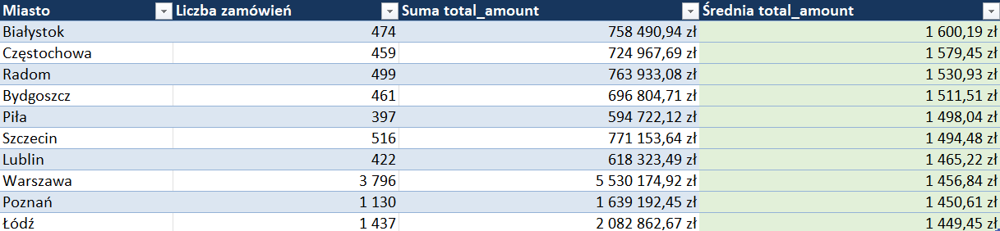

**Obserwacja:** Miasta średniej wielkości **(Białystok, Częstochowa, Radom)** mają 
wyższy średni koszyk niż Warszawa - mimo dużo mniejszej liczby zamówień. 
Różnica między najwyższym a najniższym z top 10 to ok. 150 zł (10%), więc to 
umiarkowany, nie dramatyczny efekt. 

**Rekomendacja:** Przetestować kampanię geo-targetowaną w Białymstoku i 
Częstochowie z wyższym budżetem na klienta (skoro tam klienci i tak wydają więcej) - to najlepszy test A/B do zaproponowania marketingowi na start

7. **Jakie produkty są zagrożone brakiem w magazynie w najbliższym 
miesiącu?** 

**Wynik:** **434** aktywne produkty (ok. **22%** całego katalogu) mają stan magazynowy 
na poziomie progu zamówienia lub poniżej niego, w tym 15+ produktów z zerowym 
stanem, np. "Organ Moda Eco", "Dziadek Uroda Basic", "Warzywo akcesoria". 

**Obserwacja:** Skala problemu (**22%** katalogu) jest dużo większa, niż sugerowałaby 
anegdota zarządu ("część produktów notorycznie brakuje"). To nie jest problem 
pojedynczych SKU - to problem systemowy w procesie uzupełniania zapasów.

**Rekomendacja:** Priorytetyzować automatyczne alerty reorderowe (próg już istnieje 
jako reorder_level - brakuje tylko automatyzacji akcji) zamiast ręcznego monitoringu. 
Zacząć od produktów z zerowym stanem i wysoką historyczną sprzedażą.

8. **Który kanał marketingowy generuje klientów o najwyższym LTV?** 

**Obserwacja:** Różnice są zaskakująco małe **(6 496-6 990 zł, rozstęp ~7%)** - żaden 
kanał nie "wygrywa" dramatycznie. Meta Ads generuje najwięcej klientów w liczbach 
bezwzględnych, ale ma środkowy LTV, nie najwyższy - mimo że pochłania 
największy budżet (**42%** wydatków marketingowych)

**Rekomendacja:** Skoro LTV na klienta jest podobny między kanałami, decyzję o 
alokacji budżetu oprzeć na koszcie pozyskania klienta (CAC) per kanał, a nie na LTV - to następny raport, który trzeba zestawić (dane o koszcie kampanii nie są w obecnym zbiorze ShopFlow, ale warto to zaznaczyć jako świadomą lukę, a nie 
przeoczenie). 

9. **Jaki jest realny wskaźnik zwrotów per kategoria?** 
    
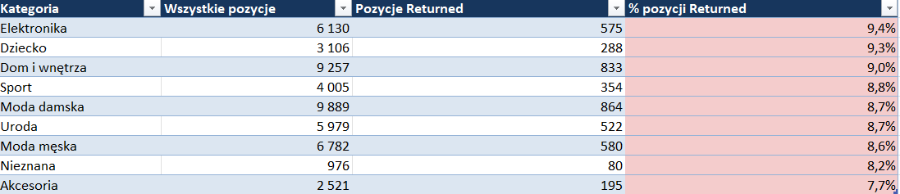

**Obserwacja:** Rozstęp jest niewielki (**7,7-9,4%**) - nie ma jednej kategorii, która 
dramatycznie odstaje. Elektronika ponownie na szczycie problematycznej listy: 
najniższa marża i najwyższy wskaźnik zwrotów jednocześnie.

**Rekomendacja:** Zbadać przyczyny zwrotów w Elektronice jako pierwszej (np. przez 
analizę komentarzy obsługi klienta, jeśli są dostępne) - to podwójny powód: i marża, i zwroty wskazują na tę samą kategorię jako priorytet.

10. **Ilu klientów robi zakupy tylko raz i nigdy nie wraca?** 

**Obserwacja:** To jest prawdziwy problem retencyjny ShopFlow - nie "22% wraca", 
tylko **15,8%** zarejestrowanych klientów nigdy nawet nie zaczęło kupować. Wśród 
tych, którzy raz kupili, zdecydowana większość (94,4%) wraca kiedykolwiek - więc 
historia "klienci nie wracają" jest błędna, ale historia "duża część zarejestrowanych 
nigdy nie kupuje" jest prawdziwa i istotna.

**Rekomendacja:** Priorytet numer jeden dla CRM: kampania aktywacyjna (nie 
retencyjna!) skierowana do **791** zarejestrowanych klientów bez żadnego 
zrealizowanego zakupu - np. rabat powitalny z ograniczonym czasem. To 
bezpośrednio odpowiada na piąty cel zarządu ("wdrożyć kulturę decyzji opartych na 
danych") - pokazuje, że dane prowadzą do innego wniosku niż intuicja. 

11. **Jaka jest średnia wartość zamówienia (AOV) w zależności od 
metody płatności?**  

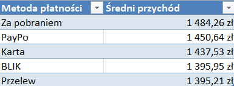

**Obserwacja:** Różnice między metodami są niewielkie **(ok. 6%)** - metoda płatności 
nie jest mocnym predyktorem wartości koszyka. "Za pobraniem", mimo najwyższego 
AOV, jest najdroższa w obsłudze logistycznej.

**Rekomendacja:** Nie ma tu pilnej rekomendacji biznesowej - to dobry przykład na to, 
że czasem niektóre rzeczy działają dobrze i należy zostawić je w nienaruszalnej 
formie zamiast wprowadzać nieefektywne zmiany na siłę.

12. **Które produkty najczęściej kupowane są razem?** 

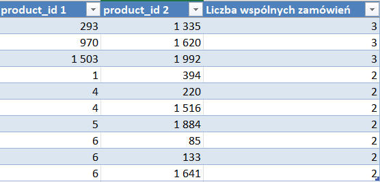

**Wynik:** Najczęściej współwystępująca para pojawia się razem **3** razy na **19 911** zamówień. Sprawdzono też, ile par w ogóle powtarza się choć dwukrotnie: **586** par 
na ok. **2000** produktów - statystyczny szum, nie wzorzec zakupowy.

**Obserwacja:** W tych danych nie ma silnego sygnału "kupowane razem" na poziomie 
pojedynczych produktów - katalog jest zbyt szeroki (2000 SKU), a przypisanie 
produktów do zamówień w danych źródłowych było w dużej mierze losowe. To 
ważna i uczciwa odpowiedź: nie każde pytanie biznesowe ma satysfakcjonującą 
odpowiedź przy dostępnych danych.

**Rekomendacja:** Nie budować rekomendacji cross-sellingowej na poziomie 
konkretnych par SKU - zamiast tego przeanalizować współwystępowanie na 
poziomie kategorii (np. "Elektronika + Akcesoria"), gdzie próbka jest dużo większa i  wniosek byłby bardziej wiarygodny.

13. **Jak wygląda sezonowość sprzedaży w poszczególnych 
kategoriach?**

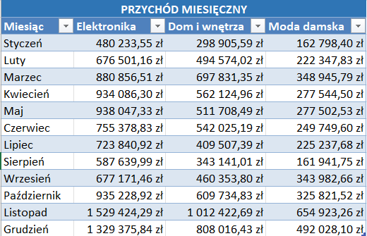

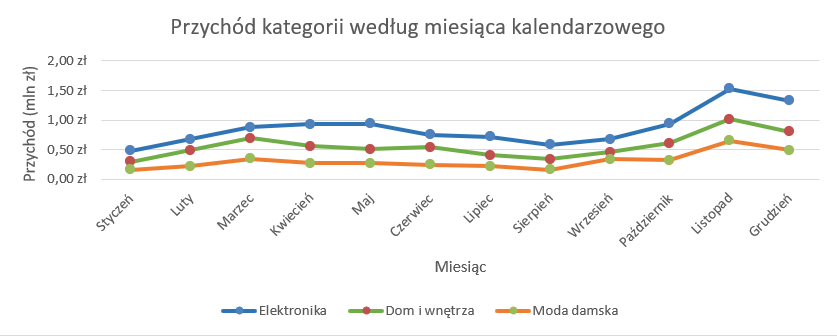

**Obserwacja:** Wszystkie trzy kategorie mają szczyt w listopadzie (Black Friday) - 
spójne z narracją biznesową. Moda Damska ma dodatkowo wyraźny dołek letni 
(sierpień), inny niż pozostałe dwie kategorie (styczeń) - sezon urlopowy silniej 
wpływa na modę niż na elektronikę czy dom.

**Rekomendacja:** Kampanie sezonowe dla Mody Damskiej powinny mieć inny 
kalendarz niż dla Elektroniki/Domu - sierpień to okazja na wyprzedaż kolekcji, nie 
okres wyciszenia budżetu. 

14.  **Czy członkowie programu lojalnościowego kupują częściej i 
więcej?**

**Obserwacja:** Brak mierzalnej różnicy - członkowie programu lojalnościowego 
zachowują się statystycznie tak samo jak pozostali klienci, a nawet nieznacznie 
gorzej na wszystkich trzech metrykach. To zaprzecza założeniu, że program 
lojalnościowy działa.

**Rekomendacja:** To jest najważniejszy pojedynczy wniosek do zakomunikowania 
zarządowi w kontekście programu ShopFlow Club (uruchomionego 8 miesięcy temu - 
być może efekt jeszcze się nie zmaterializował, ale warto to zbadać teraz, a nie za 
rok). Zaproponować: (1) sprawdzić te same metryki tylko dla klientów 
zarejestrowanych w programie od 3+ miesięcy, żeby wykluczyć efekt "za wcześnie 
na wyniki", (2) jeśli różnica nadal nie wystąpi, zrewidować mechanikę programu 
przed dalszą inwestycją w jego rozwój.

15. **Ile realnie kosztuje obsługa zamówień anulowanych i zwróconych?**

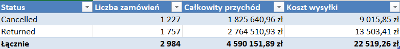

**Obserwacja:** Łącznie **15%** wszystkich zamówień kończy się anulowaniem lub 
zwrotem, blokując łącznie ok. **4,6 mln zł** wartości zamówień (nie jest to czysta strata - część produktów wraca do sprzedaży - ale generuje realny koszt operacyjny 
dostawy: ponad **22 500 zł** tylko na przesyłkach).

**Rekomendacja:** Policzyć pełny koszt obsługi zwrotu (dostawa w dwie strony + czas 
obsługi magazynowej + ewentualna utrata wartości produktu) jako osobny wskaźnik 
KPI, nie tylko wartość zamówienia. To da zarządowi pełniejszy obraz niż sama 
"wartość zablokowana". 

16. **Które produkty mają najdłuższy czas "zalegania" na magazynie?** 

**Wynik:** **830** produktów (ponad **40%** katalogu) ma stan magazynowy powyżej **500** sztuk. Top przykłady: "Dziewięć Moda Premium" (1 999 szt. w magazynie, 
sprzedanych tylko 27 szt.), "Szwedzki Moda Pro" (1 997 szt., sprzedanych 34 szt.). 

**Obserwacja:** Skala zalegania jest bardzo duża - **40%** katalogu ma stan magazynowy 
nieproporcjonalny do realnej sprzedaży. To spójne z narracją biznesową ("inne 
produkty zalegają miesiącami"), ale skala (**40%**, nie "kilka produktów") jest większa, 
niż sugerowałaby anegdota. 

**Rekomendacja:** Wprowadzić regularny raport "rotacja zapasów" (stan / sprzedaż 
miesięczna) jako stały element pracy zespołu zakupowego, z automatycznym 
oznaczaniem produktów poniżej progu rotacji do wyprzedaży lub wycofania z oferty. 

17. **Jak zmienia się liczba nowych klientów miesiąc do miesiąca w 
podziale na kanał?** 

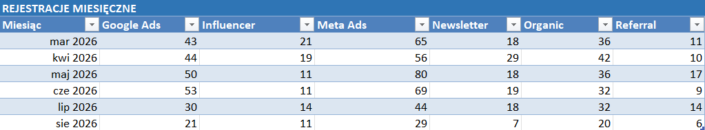

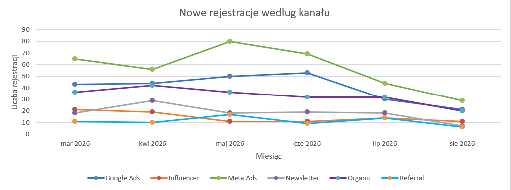

**Obserwacja:** Meta Ads konsekwentnie generuje najwięcej nowych rejestracji miesiąc 
do miesiąca - ale klienci z tego kanału mają środkowy, nie najwyższy LTV. Widać też ogólny spadek rejestracji od maja do sierpnia we 
wszystkich kanałach. 

**Rekomendacja:** Zestawić ten raport z Pytaniem 8 w jednym dashboardzie - 
wolumen pozyskania (Meta Ads na czele) i jakość pozyskania (Organic/Referral na 
czele) to dwa różne wymiary, które zarząd powinien widzieć razem, a nie osobno, 
przy podejmowaniu decyzji budżetowych. 